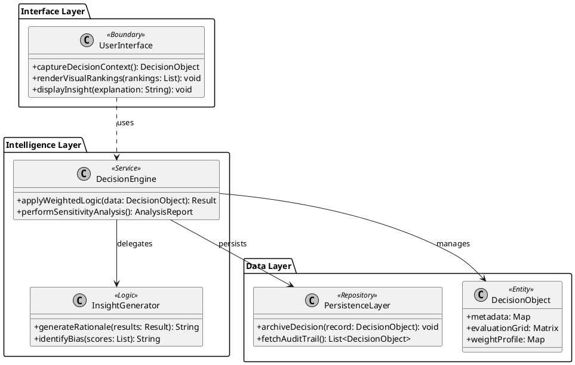
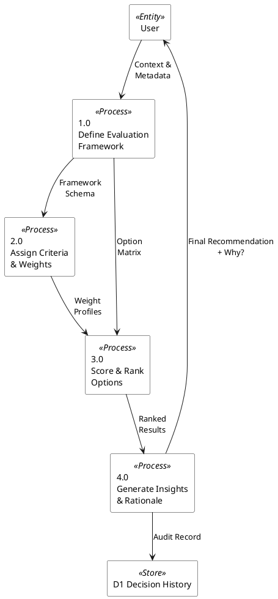
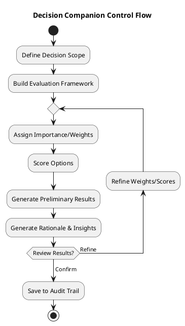
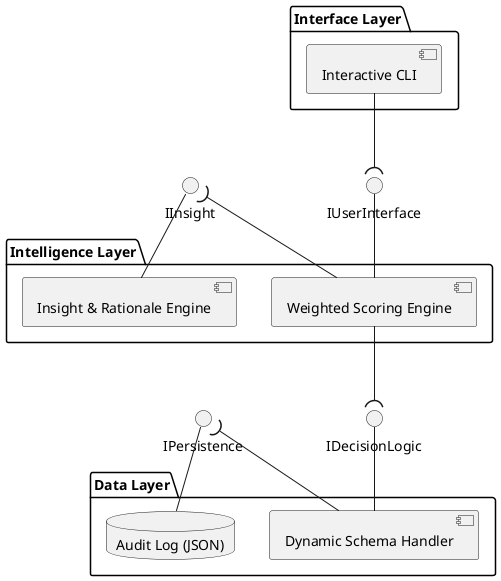

# Refined Architecture & Design (Post-Research)

This architecture reflects the "Decision Companion" philosophy: a system that provides not just math, but **clarity** and **confidence**.

> **Note:** The diagrams below are authored in **PlantUML** (UML 2.5 and Gane-Sarson DFD). Sources are located in `diagrams/`.

## 1. Architecture Diagram (UML Class Diagram)
This refined model introduces an **InsightGenerator** and an **AnalysisModel** to handle the qualitative aspects mentioned in the research.

## 2. Data Flow Diagram (Gane-Sarson)
Focuses on the transformation from **Context** to **Confidence** using standard DFD notation.

## 3. Control Flow Diagram (UML Activity Diagram)
Includes a "Review & Refine" loop to ensure the "Consistency" and "Clarity" goals are met before saving.

## 4. Component Diagram (UML)
Separates the **Execution** from the **Intelligence**.

## Key Design Principles (Post-Research)
- **Traceability (Accountability):** Every decision must have a rationale ("Why did this win?").
- **Sensitivity Analysis:** The architecture supports tweaking weights to see how "stable" a decision is.
- **Abstraction:** The engine doesn't care if it's scoring a "Car" or a "Career Path"—it only sees the weighted matrix.
